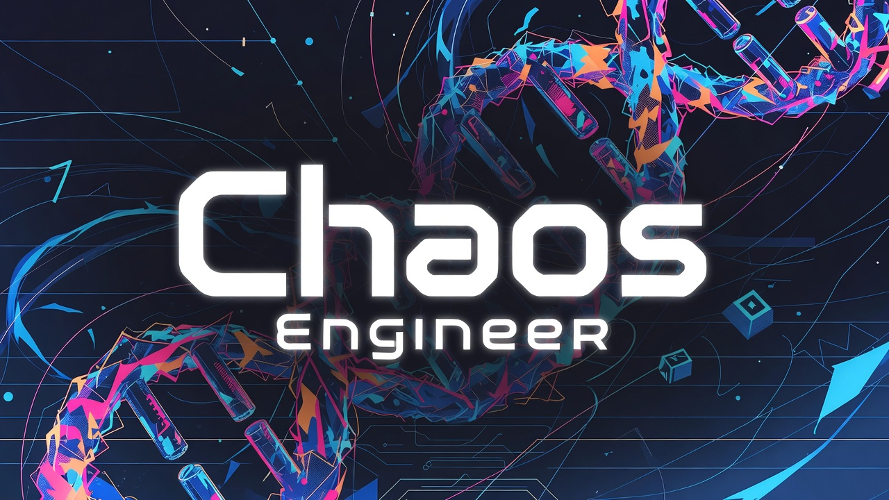

# ChaosEngineer

<p align="center">
  
</p>

---

ChaosEngineer is a fork of Karpathy's [autoresearch](README_AUTORESEARCH.md), evolved into a general-purpose parallel experimentation framework. While autoresearch gives you a single agent running experiments in a loop, ChaosEngineer adds LLM-driven experiment planning, parallel execution, budget tracking, a TUI dashboard, human-in-the-loop evaluation, and pause/resume — turning the original concept into something you can point at any optimization problem and let run unattended.

<p align="center">
  
</p>

## What it adds

- **LLM-driven experiment planning** — instead of the agent deciding what to try next on its own, a dedicated decision-maker LLM picks which dimension of the experiment space to explore and generates parameter variations using a coordinate-descent strategy.
- **Parallel execution** — run multiple experiments simultaneously using git worktrees for isolation. Each experiment gets its own branch and working directory.
- **Workload specs** — define your optimization problem in a simple Markdown format: what to run, what to measure, what parameters to explore, and budget limits. ChaosEngineer handles the rest.
- **Budget tracking** — set limits on API cost, experiment count, wall-clock time, or plateau iterations. ChaosEngineer stops gracefully when any limit is hit.
- **Pause and resume** — Ctrl+C triggers a graceful pause. Resume later with `chaosengineer resume`, optionally extending the budget.
- **TUI dashboard** — toggle a live terminal dashboard (press `t`) to see experiment progress, metrics, and budget status in real time.
- **Human-in-the-loop evaluation** — for workloads where quality can't be measured automatically (creative output, UX, etc.), ChaosEngineer can pause after each experiment and ask a human to score the result via the TUI.
- **Event bus** — an in-process event bus streams experiment events (iterations, breakthroughs, completions) to the TUI dashboard in real time.
- **Scripted/demo mode** — replay recorded experiment runs without a GPU or API key, useful for testing and demos.

## Installation

```bash
# Install with uv (recommended)
uv pip install -e .

# For Anthropic SDK backend (alternative to Claude Code CLI)
uv pip install -e '.[sdk]'
```

## Quick start

```bash
# Run the original autoresearch workflow via ChaosEngineer (sequential, one experiment at a time)
chaosengineer run workloads/autoresearch-climbmix.md \
  --llm-backend claude-code \
  --executor subagent \
  --mode sequential

# Run in parallel (faster, higher API cost)
chaosengineer run workloads/autoresearch-climbmix.md \
  --llm-backend claude-code \
  --executor subagent \
  --mode parallel

# Try the scripted demo (no GPU or API key needed)
chaosengineer run workloads/autoresearch-irish-music.md \
  --llm-backend scripted \
  --scripted-plans workloads/irish-music/scripted_plans.yaml \
  --executor scripted \
  --scripted-results workloads/irish-music/scripted_results.yaml
```

## CLI commands

| Command | Description |
|---------|-------------|
| `chaosengineer run WORKLOAD` | Start a new experiment run from a workload spec |
| `chaosengineer resume OUTPUT_DIR WORKLOAD` | Resume a paused or crashed run, optionally extending budget |
| `chaosengineer test [SCENARIO_YAML]` | Run a scenario YAML file, or all built-in scenarios if omitted |
| `chaosengineer version` | Print version |

Key flags for `run` and `resume`:

| Flag | Options | Default |
|------|---------|---------|
| `--llm-backend` | `claude-code`, `sdk`, `scripted` | `claude-code` |
| `--executor` | `subagent`, `scripted` | `subagent` |
| `--mode` | `sequential`, `parallel` | `sequential` |
| `--tui` | enable TUI dashboard on start (toggle with `t` during run) | off |
| `--initial-baseline` | override the baseline metric value | auto-detect |
| `--output-dir` | where to write run artifacts | `.chaosengineer/output` |
| `--force-fresh` | skip interactive resume prompt, start fresh | off |

Resume-specific flags: `--add-cost`, `--add-experiments`, `--add-time`, `--restart-iteration`.

## LLM backends

ChaosEngineer supports multiple LLM backends for the decision-making layer:

- **`claude-code`** (default) — invokes the [Claude Code](https://docs.anthropic.com/en/docs/claude-code) CLI as a subprocess. Uses your existing Claude subscription, no separate API key needed.
- **`sdk`** — uses the Anthropic Python SDK directly. Requires `ANTHROPIC_API_KEY`. Supports alternative Anthropic-compatible providers via `ANTHROPIC_BASE_URL` (e.g. [OpenRouter](https://openrouter.ai), [Z.AI](https://z.ai), [Kimi](https://kimi.ai)). Override the model with `ANTHROPIC_MODEL` (default: `claude-sonnet-4-20250514`).
- **`scripted`** — replays pre-recorded plans from a YAML file. No LLM calls, no API key. Useful for testing and demos.

## Writing a workload spec

A workload spec is a Markdown file that describes your optimization problem. Here's the structure:

```markdown
# Workload: My Optimization Task

## Context
What you're optimizing and why. This is passed to the LLM
for context when planning experiments.

## Experiment Space
- Directional: "learning_rate" (currently 0.001)
- Directional: "batch_size" (currently 64)
- Enum: "optimizer" options: Adam, AdamW, SGD
- Diverse: "architecture_style"

## Execution
- Command: `python train.py > run.log 2>&1`
- Time budget per experiment: 5 minutes

## Evaluation
- Type: automatic
- Metric: val_loss (lower is better)
- Parse: `grep "^val_loss:" run.log | awk '{print $2}'`
- Secondary metrics: peak_vram_mb, throughput

## Resources
- Per worker: 1 GPU
- Available: 2

## Budget
- Max experiments: 50
- Max wall time: 4h
- Max API cost: $20

## Baseline
- Metric value: 0.92

## Constraints
- Files workers may modify: train.py, config.yaml
- Do not modify evaluate.py
```

The `## Baseline` section is optional for live runs (ChaosEngineer can auto-detect the baseline by running the command once), but required when using `--executor scripted` unless you pass `--initial-baseline`.

**Dimension types:**
- **Directional** — numeric parameter to sweep up/down from a current value
- **Enum** — discrete choices from a fixed list
- **Diverse** — the LLM generates creative options on the fly (useful for open-ended dimensions like "architecture style" or "optimizer strategy")

**Evaluation types:**
- **automatic** — metric extracted from command output via the parse command
- **human** — ChaosEngineer pauses after each experiment and prompts for a human score via the TUI

## Architecture

```
┌─────────────────────────────────────────────────────┐
│                    CLI (cli.py)                     │
├─────────────────────────────────────────────────────┤
│              Coordinator (core/)                    │
│  ┌──────────┐ ┌──────────┐ ┌────────┐ ┌──────────┐  │
│  │ Budget   │ │ Snapshot │ │ Pause  │ │ State    │  │
│  │ Tracker  │ │ & Resume │ │ Control│ │ Machine  │  │
│  └──────────┘ └──────────┘ └────────┘ └──────────┘  │
├──────────────────┬──────────────────────────────────┤
│  LLM Layer       │  Execution Layer                 │
│  ┌────────────┐  │  ┌─────────────┐ ┌────────────┐  │
│  │ Decision   │  │  │ Subagent    │ │ Worktree   │  │
│  │ Maker      │  │  │ Executor    │ │ Manager    │  │
│  ├────────────┤  │  ├─────────────┤ └────────────┘  │
│  │ Claude Code│  │  │ Task Packet │                 │
│  │ SDK        │  │  │ Builder     │                 │
│  │ Scripted   │  │  │ Result      │                 │
│  └────────────┘  │  │ Parser      │                 │
│                  │  └─────────────┘                 │
├──────────────────┴──────────────────────────────────┤
│  Metrics & Events                                   │
│  ┌────────────┐ ┌────────────┐ ┌─────────────────┐  │
│  │ Event      │ │ Event      │ │ Event           │  │
│  │ Logger     │ │ Publisher  │ │ Bridge (bus.py) │  │
│  └────────────┘ └────────────┘ └─────────────────┘  │
├─────────────────────────────────────────────────────┤
│  TUI Dashboard (Textual)                            │
│  ┌──────────┐ ┌──────────────┐ ┌──────────────────┐ │
│  │ Budget   │ │ Experiment   │ │ Eval             │ │
│  │ Bar      │ │ Table        │ │ Gate             │ │
│  └──────────┘ └──────────────┘ └──────────────────┘ │
└─────────────────────────────────────────────────────┘
```

## How a run works

1. **Parse** the workload spec and resolve the baseline metric (from spec, CLI flag, or auto-detection).
2. **Plan** — the LLM decision maker picks a dimension to explore and generates parameter variations.
3. **Execute** — experiments run in parallel (git worktrees) or sequentially. Each experiment modifies the target files, runs the command, and parses the metric.
4. **Evaluate** — results are compared to the current baseline. Improvements advance the baseline; ties can fork into parallel baselines (beam search).
5. **Log** — every event is written to `events.jsonl` and streamed to the bus.
6. **Repeat** until budget is exhausted, the LLM signals it's done, or the user pauses with Ctrl+C.

Paused runs can be resumed with `chaosengineer resume`, which reconstructs state from the event log and picks up where it left off.

## License

MIT
